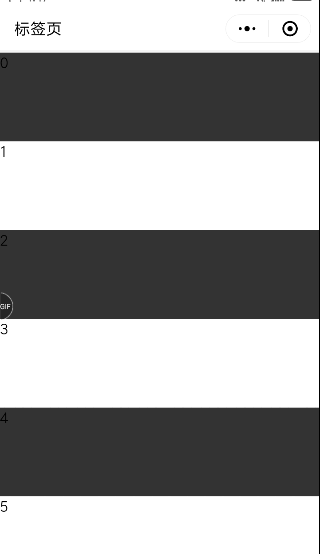

# 微信小程序 基于scroll-view 下拉刷新


## 说明
由于官方scroll-view组件只有滚到顶部刷新的机制，对用户来说不是很友好，所以做一个基于scroll-view的下拉刷新组件（该组件支持原生引用、wexp框架、wepy框架）

## 展示

## 使用

### 安装组件
```
npm i weapp-scroll-view-refresh -S --production
```

### 使用示例
```json
  usingComponents: {
    'k-scroll': 'weapp-scroll-view-refresh/index'
  }
```

```html
  <k-scroll
    id="k-scroll" 
    custom-class="scroll-view"
    bind:refresh="refresh"
    bind:scroll="scroll"
    bind:lower="lower">
      <view>content</view>
  </k-scroll>
```

## API
### 组件参数
| 参数 | 说明 | 类型 | 可选值 | 默认值 |
|-----------|---------------------------------|-----------|-----------|-------------|
| lowerThresHold | 距底部多远时触发 scrolltolower 事件 | `Number` | ` ` | `50` |
| scrollWithAnimation | 在设置滚动条位置时使用动画过渡 | `Boolean` | `true` `false` | `false` |
| enableBackToTop | iOS点击顶部状态栏、安卓双击标题栏时，滚动条返回顶部，只支持竖向 | `Boolean` | `true` `false` | `false` |
| scrollIntoView | 值应为某子元素id（id不能以数字开头）。设置哪个方向可滚动，则在哪个方向滚动到该元素 | `String` | ` `  | ` ` |


### Event

| 事件名 | 说明 | 参数 |
|-----------|-----------|-----------|
| bind:scroll | 组件滚动触发该事件 | event.detail: 回传滚动的高度 |
| bind:scrollToLower | 组件滚动到底部触发该事件 | 无回传参数 |
| bind:refresh | 组件刷新操作的时候触发该事件 | 无回传参数 |

### 函数

| 事件名 | 说明 | 参数 |
|-----------|-----------|-----------|
| reset | 重置刷新状态 | `-` |


## 更多说明
参考[原版插件](https://github.com/Chaunjie/weapp-scroll-view-refresh)。