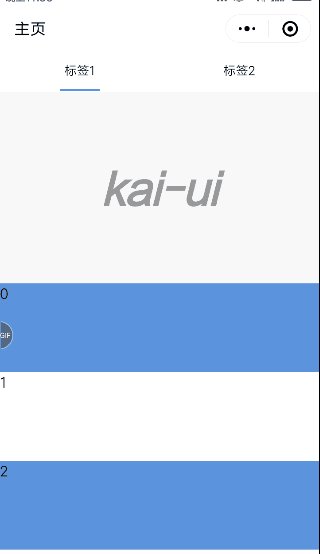

# 微信小程序 wepyjs 基于scroll-view 下拉刷新


## 说明
官方scroll-view组件不支持下拉刷新，只有滚到顶部刷新的机制，所以做一个基于scroll-view的下拉刷新组件。

## 展示

## 使用

### 安装组件
```
npm i wepy-scroll-view-refresh --save-dev
```

### 使用提示
```javascript
1、该组件外面必须套用scroll-y的scroll-view(暂时不支持横向滚动)
2、scroll-view必须使用scroll事件实时向该组件传递一个scrollTop（scroll-view的scrollTop）参数
3、内容区域用卡槽slot="refresh-content"部分填充
4、组件刷新会触发refresh事件，父页面需要在events内接收一个refresh的事件
5、重置刷新组件调用this.$invoke('refresh', 'reset')方法
```

### 使用示例
```javascript
// index.wpy
<template>
  <view class="kai-content">
    <scroll-view scroll-y="{{true}}" class="refresh-scroll__container" scroll-with-animation="{{true}}" bindscrolltolower="lower" style="width: 100vw;height:100vh;" catchscroll="scroll">
      <view style="width:100%;height:100%;">
        <refresh :scrollTop.sync="scrollTop">
          <view slot="refresh-content" style="margin-top:45px;">
            <repeat for="{{[0,1,2,3,4,5,6,7,8,9,10]}}" index="i" item="item" key="new-{{i}}">
              <view  class="new-block">
                {{i}}
              </view>
             </repeat>
           </view>
        </refresh>
      </view>
   </scroll-view>
</view>
</template>
<script>
import wepy from 'wepy'
import Refresh from 'wepy-scroll-view-refresh'

export default class ScrollViewRefresh extends wepy.page {
  components = {
    refresh: Refresh
  }

  data = {
    scrollTop: 0
  }

  methods = {
    lower (index) {
      console.log(index)
    },
    scroll (e) {
      this.scrollTop = e.detail.scrollTop
      this.$apply()
    }
  }

  events = {
    'refresh': (data) => {
      setTimeout(() => {
        this.$invoke('refresh', 'reset')
      }, 3000)
    }
  }
}
</script>
```


### 刷新重制方法
```javascript
this.$invoke('refresh', 'reset')
```

## 更多说明
参考[原版插件](https://github.com/Chaunjie/weapp-scroll-view-refresh)。